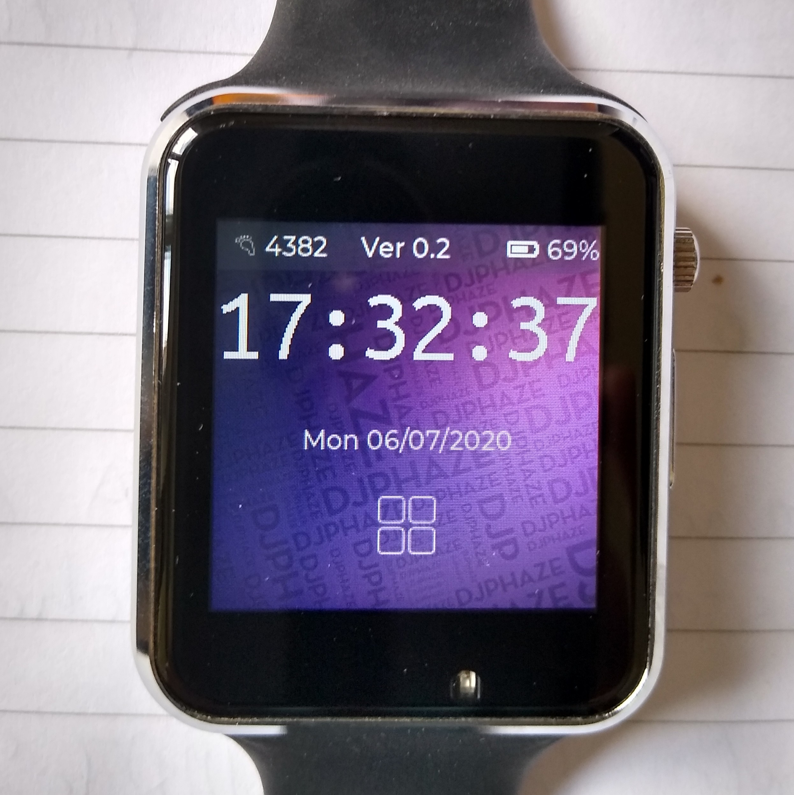

# agoodWatch

## A TTGO-T-Watch-2020 Arduino sketch

First ensure that you have installed the TTGO_TWatch_Library, then put the agoodTwatch directory into your Arduino sketch area.

This code is derived from the SimpleWatch example in the [Xinyuan LilyGO TTGO_TWatch GitHub repository](https://github.com/Xinyuan-LilyGO/TTGO_TWatch_Library).

I have had to make some changes to the above library code for the low level access routines. (As of Version 0.2, all changes have been accepted into the main branch so all current versions of agoodWatch can use either my library fork or the LilyGO main branch.)

### Version 0.3
1. Forgot to put an exit button on the empty "About" screen - doh!
2. Populate the "About" screen.
3. Improved torch mode to now make the whole screen white for extra light.

### Version 0.2
1. Fix button event detection difference in the latest version of LVGL.
2. Add better comments - this will be an ongoing effort for each version!
3. Add max screen brightness mode for sunny days - just double tap whilst the screen is on and it will go to full brightness.
4. Add a torch mode for when the kids get you up in the middle of the night - first wake the watch using either the bezel button, double tap or tilt. Then double tap the watch to switch to full sun mode and then double tap again. The screen will stay on for 5 minutes or until the bezel button is used to put the watch back to sleep.

### Version 0.1 has added ...
1. Add seconds to the time.
2. Add day and date.
3. NTP is now GMT.
4. Update display before enabling it after wakeup (otherwise is displays the old time for up to a second).
5. The time is British Summer Time aware.
6. The wrist tilt display activation works.
7. Double tapping the watch will also wake it.
8. ESP32 light sleep mode is used to extend the battery usage.
9. The backlight dims between 10pm and 8am (saving battery).
10. The backlight remembers it's setting.
